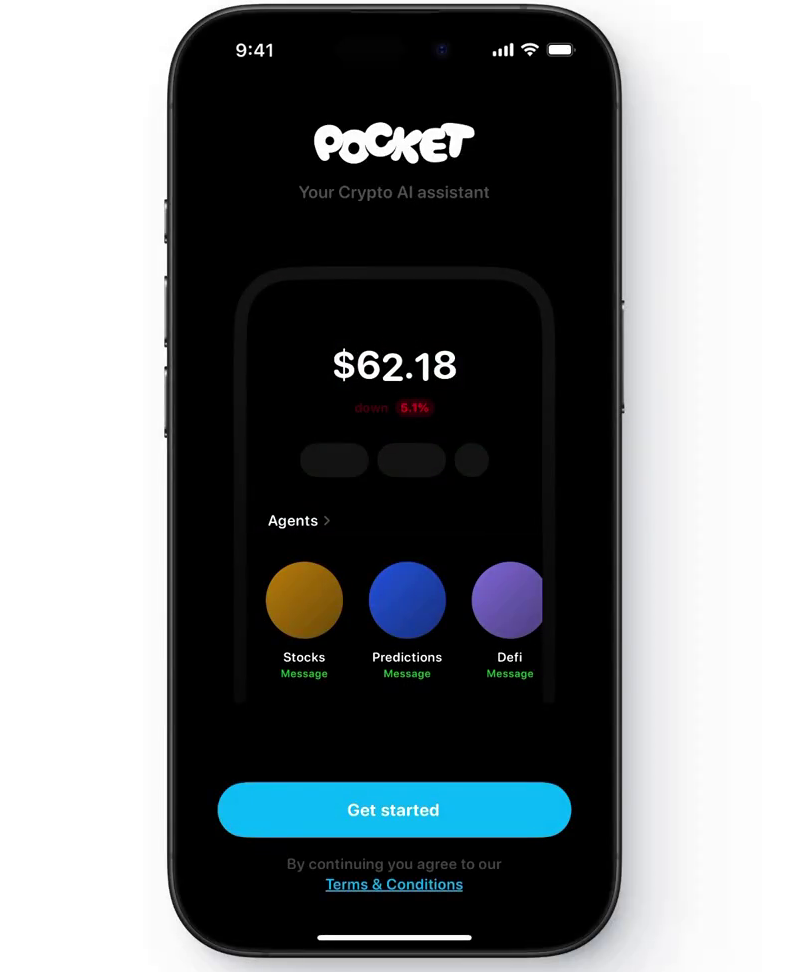
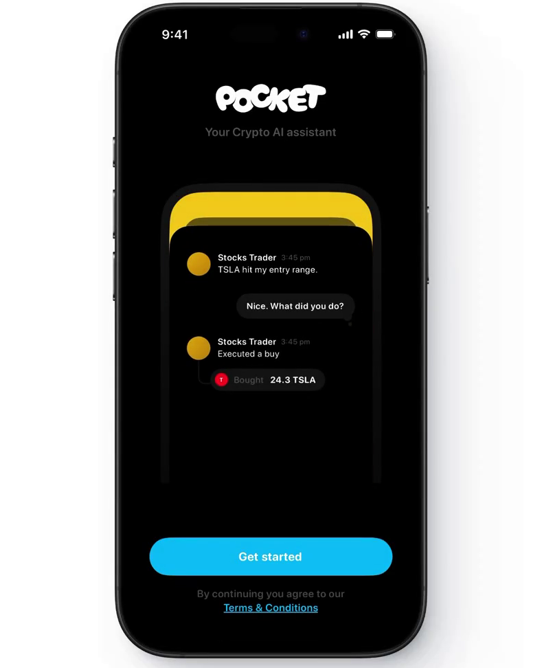
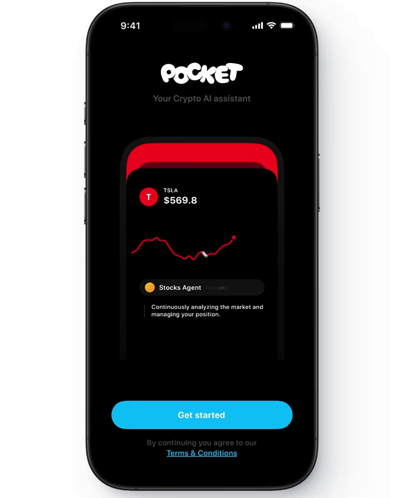

# Pocket - Your Crypto AI Assistant

Crypto AIアシスタントiOSアプリ「POCKET」のSwiftUIプロジェクトです。

## 概要

POCKETは、AIエージェントが株式・暗号通貨の取引を自動化するコンセプトのiOSアプリです。洗練されたダークテーマのUIと、カルーセル形式のオンボーディング画面を備えています。

## スクリーンショット

| ポートフォリオ | チャット | 株式チャート |
|:---:|:---:|:---:|
|  |  |  |

## 機能

| 機能 | 説明 |
|------|------|
| ポートフォリオ表示 | 残高と変動率をリアルタイムで表示 |
| AIエージェント | Stocks、Predictions、Defiの3種類のAIエージェント |
| チャットインターフェース | エージェントとの対話形式の取引通知 |
| 株式チャート | ミニ折れ線チャートによる価格推移表示 |
| カルーセルUI | 自動スクロール付きのカード切り替え |
| アニメーション | フェードイン・スライドインの滑らかなアニメーション |

## 技術スタック

| 項目 | 詳細 |
|------|------|
| 言語 | Swift 5.9+ |
| フレームワーク | SwiftUI |
| 最小対応OS | iOS 16.0 |
| アーキテクチャ | MVVM |
| デザインパターン | Combine, ObservableObject |

## プロジェクト構造

```
PocketApp/
├── Package.swift
├── README.md
├── screenshots/
│   ├── 01_portfolio_card.png
│   ├── 02_chat_card.png
│   └── 03_stock_chart_card.png
└── Pocket/
    └── Sources/
        ├── PocketApp.swift
        ├── Models/
        ├── ViewModels/
        ├── Views/
        ├── Components/
        └── Extensions/
```

## セットアップ方法

### Xcodeプロジェクトとして使用する場合

1. Xcodeで新しいiOSプロジェクトを作成します（Interface: SwiftUI, Language: Swift）
2. 既存のContentView.swiftを削除します
3. `Pocket/Sources/` 内の全ファイルをプロジェクトにドラッグ＆ドロップします
4. `PocketApp.swift` がアプリのエントリーポイントとして設定されていることを確認します
5. ビルドターゲットをiOS 16.0以上に設定します
6. ビルドして実行します

### Swift Package として使用する場合

1. このディレクトリをXcodeで開きます
2. `Package.swift` が自動的に認識されます
3. ビルドして実行します

## デザイン仕様

### カラーパレット

| 色名 | 用途 | HEX値 |
|------|------|-------|
| Pocket Cyan | アクセントカラー、ボタン | #00D9F2 |
| Background | 背景色 | #000000 |
| Card Background | カード背景 | #1F1F24 |
| Agent Stocks | Stocksエージェント | #C7A64D |
| Agent Predictions | Predictionsエージェント | #4073E6 |
| Agent Defi | Defiエージェント | #9973CC |
| Pocket Red | 下落表示、TSLAカラー | #E63333 |

### アニメーション

アプリ起動時にコンテンツが段階的にフェードインし、カルーセルカードは4秒間隔で自動スクロールします。ユーザーが手動でスワイプした場合は、8秒後に自動スクロールが再開されます。

## ライセンス

このプロジェクトはデモンストレーション目的で作成されています。
